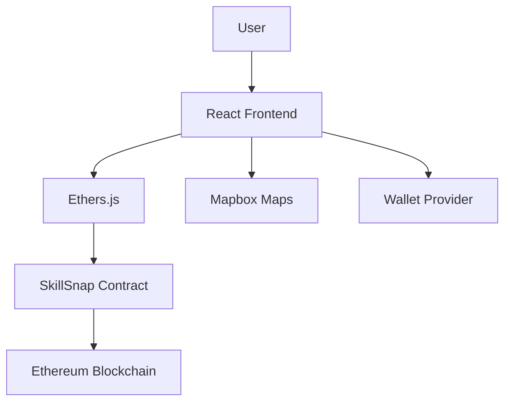

# 🚀 DEvelopers Dojo - Decentralized Task Marketplace

**DEvelopers Dojo** is a blockchain-powered platform where users can post tasks and get them completed by skilled individuals in their local area. Think of it as a decentralized TaskRabbit with crypto payments, location-based matching, and smart contract automation.


**Developed only on Flow -> mainnet address [0x41E658e3f4672F3F8215662Fc99B9F6909E8a201] thanks Jz for tokens**


## 🌟 Features


- **🔗 Blockchain Integration**: Smart contracts on Flare/Ethereum for secure, trustless transactions
- **🔥 Flare Features**: FAssets (BTC/XRP payments), FDC (auto-release), FTSO (USD pricing), Smart Accounts (gasless)
- **🗺️ Location-Based Matching**: Interactive maps to find tasks near you
- **💼 Skill Categories**: Digital services, physical tasks, consulting, and more
- **🔐 Wallet Integration**: Connect with MetaMask, WalletConnect, Privy, and other popular wallets
- **💰 Multi-Token Payments**: Pay with FLR, BTC (FAsset), XRP (FAsset), ETH, or any supported token
- **💵 USD Pricing**: Price tasks in USD with automatic token conversion via FTSO
- **⚡ Gasless UX**: Optional gasless transactions via Flare Smart Accounts
Build trust through completed tasks and reviews
- **📱 Responsive Design**: Works seamlessly on desktop and mobile

## 🏗️ Project Structure

```
developers-dojo/
├── smart-contracts/         # Solidity smart contracts
│   ├── contracts/
│   │   ├── TaskEscrow.sol   # Base escrow contract
│   │   └── FlareAdapter.sol # Flare feature adapter
│   ├── test/               # Contract tests
│   ├── scripts/            # Deployment scripts
│   └── hardhat.config.js   # Hardhat configuration
├── backend/                # Express API server
│   ├── server.js           # Main server (FTSO, FDC, FAssets, Smart Accounts)
│   ├── tests/              # API tests
│   └── scripts/            # Utility scripts
├── frontend/               # React + Vite frontend
│   ├── src/
│   │   ├── components/     # UI components
│   │   ├── lib/            # Libraries (escrow, flare, etc.)
│   │   └── pages/          # Application pages
│   └── package.json        # Frontend dependencies
├── supabase/
│   └── migrations/         # Database migration scripts
└── README.md              # This file
```

## 🚀 Quick Start

### Prerequisites

- Node.js (v16 or higher)
- npm or yarn
- MetaMask or another Web3 wallet

### 1. Clone the Repository

```bash
git clone <your-repo-url>
cd skillsnap
```

### 2. Setup Smart Contracts

```bash
cd smart-contracts
npm install
```

Create `.env` file:
```bash
PRIVATE_KEY=your_private_key_here
INFURA_API_KEY=your_infura_key_here
ETHERSCAN_API_KEY=your_etherscan_key_here
```

Compile and test contracts:
```bash
npx hardhat compile
npx hardhat test
```

Deploy to testnet:
```bash
npx hardhat run scripts/deploy.js --network sepolia
```

### 3. Setup Backend (New - Flare Integration)

```bash
cd ../backend
npm install
```

Create `.env` file (see `backend/.env.example`):
```bash
FLARE_RPC=https://flare-api.flare.network/ext/C/rpc
FTSO_ORACLE_ADDR=0x...
FDC_ENDPOINT=https://api.flare.network/fdc
SUPABASE_URL=https://your-project.supabase.co
SUPABASE_KEY=your-supabase-key
SPONSOR_WALLET_PRIVATE_KEY=0x...  # For gasless transactions
FLARE_ADAPTER_ADDRESS=0x...       # After deployment
```

Start backend server:
```bash
npm start
# or for development with watch mode:
npm run dev
```

### 4. Setup Frontend

```bash
cd ../frontend
npm install
```

Create `.env` file (see `frontend/.env.example`):
```bash
VITE_MAPBOX_API=your_mapbox_token_here
VITE_FLARE_ADAPTER_ADDRESS=0x...  # After deployment
VITE_NETWORK_ID=16                # Flare Mainnet (114 for Coston testnet)
VITE_API_URL=http://localhost:3000
VITE_PRIVY_APP_ID=your-privy-app-id
VITE_SUPABASE_URL=https://your-project.supabase.co
VITE_SUPABASE_ANON_KEY=your-supabase-key
```

Start development server:
```bash
npm run dev
```

### 5. Run Database Migration

Execute `supabase/migrations/add_flare_fields.sql` in your Supabase SQL Editor to add Flare-specific columns.

## 🔧 Configuration

### Environment Variables

#### Smart Contracts (.env)
- `PRIVATE_KEY`: Your wallet private key for deployment
- `INFURA_API_KEY`: Infura project API key
- `ETHERSCAN_API_KEY`: For contract verification

#### Frontend (.env)
- `VITE_MAPBOX_API`: Mapbox access token for maps
- `VITE_CONTRACT_ADDRESS`: Deployed smart contract address
- `VITE_NETWORK_ID`: Ethereum network ID (11155111 for Sepolia)

### API Keys Setup

1. **Mapbox**: Get a free API key at [mapbox.com](https://www.mapbox.com/)
2. **Infura**: Create a project at [infura.io](https://infura.io/)
3. **Etherscan**: Get API key at [etherscan.io](https://etherscan.io/apis)

## 🔥 Flare Integration

This project now includes comprehensive Flare blockchain features:

### Features

- **FAssets**: Pay with wrapped non-EVM assets (BTC, XRP) via bridge
- **FDC (Flare Data Connector)**: Off-chain verification triggers on-chain auto-release
- **FTSO (Flare Time Series Oracle)**: USD ↔ Token price conversion for flexible pricing
- **Smart Accounts**: Gasless transactions via Account Abstraction

### Documentation

See **[FLARE_INTEGRATION.md](./FLARE_INTEGRATION.md)** for detailed setup and usage instructions.

### Quick Example

```javascript
// Price task in USD, automatically converts to FLR via FTSO
const result = await convertUSDToToken(100, 'FLR');
// Returns: { totalAmount: "10500", rate: "0.01", ... }

// Fund escrow with native FLR or FAsset
await fundEscrowFlare(task, false); // useGasless = false
await fundEscrowFAsset(task, fassetBTCAddress);

// FDC auto-release when condition is met
await registerFDCCondition(taskId, conditionHash);
// FDC oracle calls releaseIf() automatically
```

## 📋 Smart Contract Features

### Core Functions (TaskEscrow)

- `fund(taskId, worker)`: Deposit escrow funds
- `release(taskId)`: Release funds to worker
- `cancel(taskId)`: Refund to poster

### Flare Features (FlareAdapter)

- `fundNative(taskId, worker, tokenType)`: Fund with native FLR
- `fundFAsset(token, taskId, worker, amount)`: Fund with FAsset (ERC20)
- `registerCondition(taskId, conditionHash)`: Register FDC condition
- `releaseIf(conditionHash)`: FDC-triggered auto-release (oracle only)

### Security Features

- Escrow system for secure payments
- Role-based access control (FDC oracle)
- Minimal on-chain logic (adapter pattern)
- Standard escrow invariants enforced

## 🎯 Usage Examples

### Posting a Task

```javascript
// Frontend interaction
const tx = await skillSnapContract.createTask(
  "Help me move furniture",
  "Need help moving couch and boxes",
  "Boston, MA",
  "Physical",
  deadline,
  { value: ethers.utils.parseEther("0.05") }
);
```

### Accepting a Task

```javascript
const tx = await skillSnapContract.acceptTask(taskId);
```

## 🛣️ Roadmap

- [ ] **Phase 1**: Core marketplace functionality ✅
- [ ] **Phase 2**: Reputation system and reviews
- [ ] **Phase 3**: Multi-token payments (USDC, DAI)
- [ ] **Phase 4**: Mobile app (React Native)
- [ ] **Phase 5**: DAO governance for disputes
- [ ] **Phase 6**: Integration with major gig platforms

## 🤝 Contributing

We welcome contributions! Please see our [Contributing Guide](CONTRIBUTING.md) for details.

### Development Setup

1. Fork the repository
2. Create a feature branch: `git checkout -b feature/your-feature`
3. Commit changes: `git commit -am 'Add some feature'`
4. Push to branch: `git push origin feature/your-feature`
5. Submit a pull request

## 📄 License

This project is licensed under the MIT License - see the [LICENSE](LICENSE) file for details.

## 🔍 Testing

### Smart Contracts
```bash
cd smart-contracts
npx hardhat test
npx hardhat coverage
```

### Frontend
```bash
cd frontend
npm test
npm run test:e2e
```

## 📊 Architecture



## 🆘 Support

- **Documentation**: [docs.skillsnap.dev](https://docs.skillsnap.dev)
- **Discord**: [Join our community](https://discord.gg/skillsnap)
- **Twitter**: [@SkillSnapDeFi](https://twitter.com/SkillSnapDeFi)
- **Email**: support@skillsnap.dev

## 🏆 Acknowledgments

- OpenZeppelin for secure smart contract patterns
- Hardhat for development framework
- React and Vite for frontend framework
- Mapbox for location services

---

**Built with ❤️ for the decentralized future**
